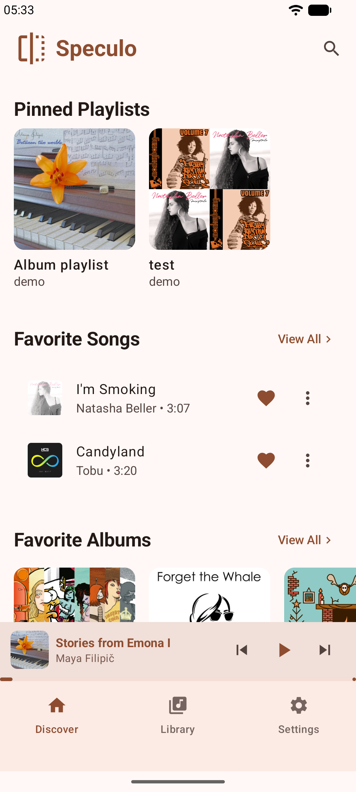
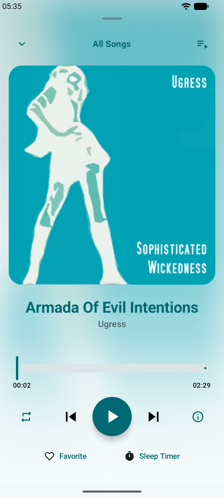
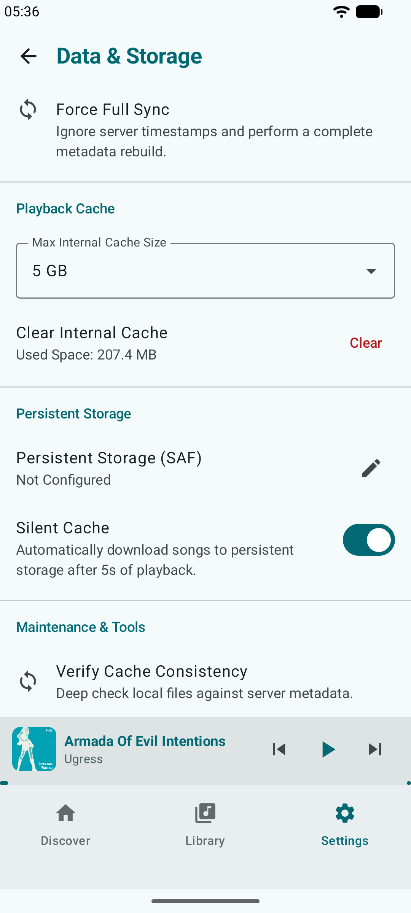

# Speculonic

**Download Latest**

[](https://github.com/lwp2070809/speculonic-android/releases/latest)

[简体中文](#简体中文)

---

Speculonic is an open-source OpenSubsonic / Subsonic (v1.16.1) music client built with native Android technologies. Compatibility with Navidrome servers has been fully verified.

The project is built on the philosophy of treating the application as a local mirror of the remote Subsonic server. It provides synchronization and diff capabilities with remote Subsonic servers, alongside the performance and extensibility of a high-performance local music player.

## Features

* **Native Android Development**: Built on native Android Jetpack Compose and Kotlin technologies. Supports adaptive responsive layouts for both mobile phones and tablets/large screens. Uses Media3 ExoPlayer as the playback engine.
* **Subsonic Local Mirror**: Provides incremental Subsonic metadata synchronization, persisted to a local database. Built-in consistency validation analyzes and reconciles discrepancies between cached music files and remote Subsonic server data.
* **Car Connectivity**: Detects car bluetooth profiles and device fingerprints, hijacking the underlying AVRCP protocol to push real-time scrolling lyrics to car dashboards.
* **Theme System**: Supports dark theme. The playback UI performs dynamic color extraction and contrast checks from the current album art, providing Gaussian-blurred and glow-gradient dynamic backgrounds.

## Requirements

* **Android Version**: Android 12.0 (API 31) or higher.

## Roadmap

- [x] Provide Github Action builds
- [ ] Publish on F-Droid
- [ ] Refactor tablet UI layout
- [ ] Provide Android X86 builds
- [x] Deliver compatibility updates within 3 months of new Android API releases

## Build

Ensure you have JDK 17 installed and the `JAVA_HOME` environment variable configured correctly.

* **Windows**:
  ```cmd
  gradlew.bat assembleDebug
  ```
* **Linux / macOS**:
  ```bash
  ./gradlew assembleDebug
  ```

## Build Variants

The GitHub Actions build artifacts include a GitHub-based update checker and an easter egg feature, both of which are injected at build time through environment variables. The corresponding workflow definitions and build logs are publicly available for audit and verification.

Locally built versions from the source code, as well as future F-Droid releases, do not contain these features. Their contents can be independently verified by reviewing the source code and reproducing the build process.

## License & Distribution Guidelines

The source code of this software is licensed under the GNU Affero General Public License v3.0 (AGPLv3). For detailed copyright information, please refer to the COPYRIGHT file in the root directory.

If you distribute a modified version of this software:
* You must comply with the AGPLv3 license requirements;
* You must clearly indicate significant modifications made to the codebase;
* You may not use the Speculonic name, logo, icon, or official branding assets without explicit, prior written permission from the copyright holder.

## Screenshot

| Home | Player | Settings |
|------|---------|---------|
|  |  |  |

---

## 简体中文

Speculonic 是一款使用 Android 原生技术开发的开源 OpenSubsonic / Subsonic (v1.16.1) 音乐客户端, 已验证与 Navidrome 服务器的兼容性.

本项目基于 "将 App 作为远程 Subsonic 服务器的本地镜像" 的设计理念, 具备与远程 Subsonic 服务器同步与对比差异的能力, 同时具备本地播放器的高性能与扩展接口.

## 功能特性

* **Android原生开发**: 基于 Android 原生Jetpack Compose和kotlin技术构建. 支持手机端与平板电脑的响应式自适应布局. 播放引擎为Media3 ExoPlayer.
* **Subsonic本地镜像**: 提供增量Subsonic元数据同步机制, 并持久化到本地数据库. 内置数据一致性校验, 能分析并修复已缓存音乐文件与远程Subsonic服务器中数据的差异.
* **车辆互联适配**: 可以嗅探车机蓝牙广播与设备指纹来判断是否连接到车载蓝牙音频; 劫持底层 AVRCP 协议, 将歌曲实时同步歌词投送到车载屏幕.
* **主题系统**: 支持深色主题. 播放界面可根据当前曲目封面执行动态色彩提取与对比度校验, 提供高斯模糊和微光渐变两种美观的播放器背景.

## 系统要求

* **Android 版本**: Android 12.0 (API 31) 及以上.

## 开发路线图

- [x] 提供 Github Action 构建
- [ ] 上架 F-Droid
- [ ] 重构平板电脑的 UI
- [ ] 提供 Android X86 版本
- [x] 在 Android 新 API 版本发布 3 个月内提供适配

## 本地构建

请确保已安装 JDK 17 并配置好 `JAVA_HOME` 环境变量.

* **Windows**:
  ```cmd
  gradlew.bat assembleDebug
  ```
* **Linux / macOS**:
  ```bash
  ./gradlew assembleDebug
  ```

## 版本差异

Github Actions打包发布的版本将通过环境变量的形式, 注入基于Github的更新检测机制以及彩蛋机制. 您可以检查workflow脚本和构建日志进行审计. 您下载代码并执行本地构建的版本, 以及未来将提供的F-Droid版本, 则绝对不包含上述内容.

## 开源协议与分发许可

本软件的源代码采用 GNU Affero General Public License v3.0 (AGPLv3) 协议开源. 详细版权条款参见根目录 COPYRIGHT 文件.

如果您分发本软件的修改版本:
* 您必须遵守 AGPLv3 许可协议的要求;
* 您必须清晰地标明对原有代码的重大修改;
* 未经版权所有者明确许可, 您不得在分发版本中使用 Speculonic 的名称, Logo, 图标或官方品牌资产.
